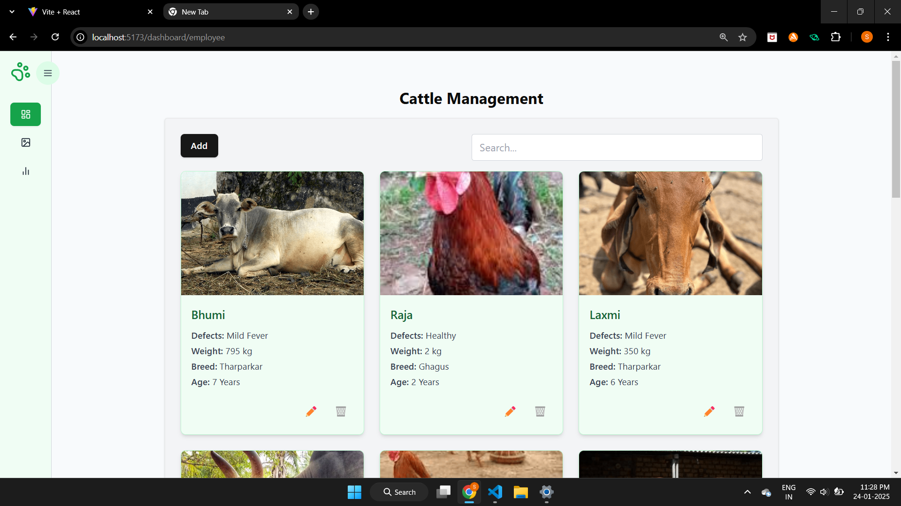
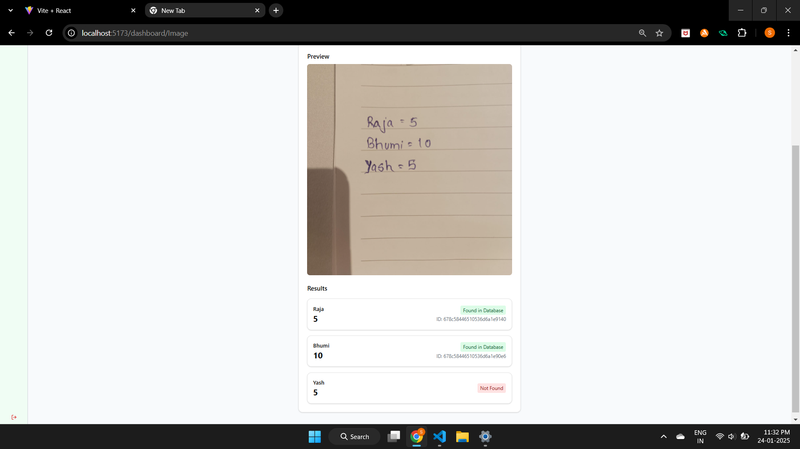
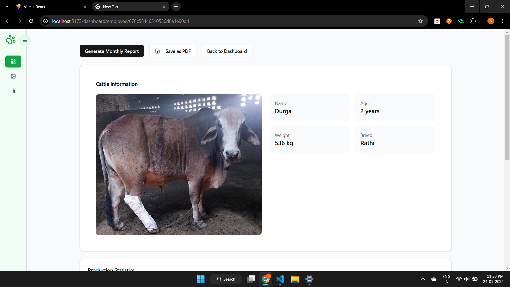
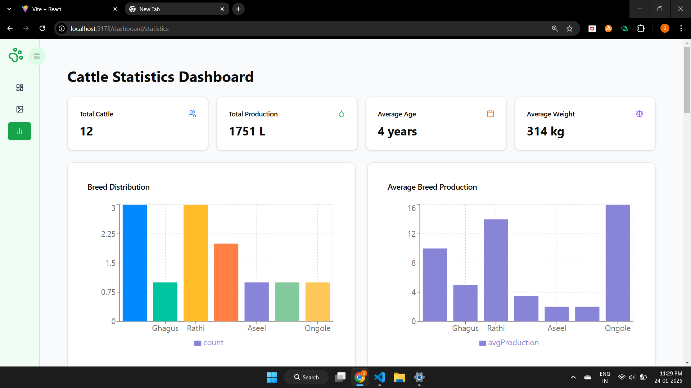

# 🐄 Empowering Farmers: Livestock Management Platform 
🎮 *Top 20 Finalists in PanIIT Imagine Hackathon 2025 held at Jio World Centre* 🎮  

Welcome to our **Livestock Management Platform** – a cutting-edge solution designed to help farmers efficiently manage their livestock, automate data tracking, and improve productivity using advanced AI and analytics.

---

## 🌟 Features

- **Effortless Cattle Management** 🐄  
  Farmers can easily list, update, and track their livestock data with intuitive CRUD operations.  

- **AI-Powered Output Tracking** 🤖  
  Simplified daily updates: Farmers upload a photo or handwritten note, and our AI processes it to automatically update the database.  

- **Individual Cattle Health Analysis** 🩺  
  AI-driven insights to monitor the health and productivity of each animal, with statistical breakdowns.  

- **Downloadable Reports** 🗂️  
  Generate PDF reports for individual cattle and overall farm performance, helping farmers make data-driven decisions.  

- **Comprehensive Analytics** 📊  
  Track trends and performance across the entire livestock population with detailed dashboards and summaries.  

- **User-Friendly Accessibility** 🌐  
  A simple and intuitive platform designed for farmers, regardless of their technical expertise.  

---

## 🚀 Tech Stack

- **Frontend:** React, Tailwind CSS
- **Backend:** Node.js, Express.js  
- **Database:** MongoDB  
- **AI Integration:** Gemini Api 

---

## 📋 Key Functionalities

1. **CRUD Operations** – Seamless data management for farmers' livestock.  
2. **Automated Data Input** – Simplified updates via AI image recognition from uploaded notes or photos.  
3. **Health Monitoring** – Individual cattle health statistics and analysis.  
4. **PDF Reports** – Easy exportable reports for farmers' records.  
5. **Overall Analytics** – Insights into livestock trends and productivity.  

---

## 📸 **Screenshots**  

### 1️⃣ Cattle List
  

### 2️⃣ AI Image Input  
  

### 3️⃣ Health Analysis  
  

### 4️⃣ Analytics  
  

---

## 📜 **Credits**  
- **Developers**: [@Shubham_Bendre](https://github.com/Shubham-Bendre), [@Malhar_Singh](https://github.com/Malhar2400), [@Yash_Chougule](https://github.com/YxASH), [@Suyog_Sable](https://github.com/Suyog_Sable)  
- **Special Thanks**: To PanIIT Imagine Hackathon 2025 and all the mentors who supported us! 🎉  
